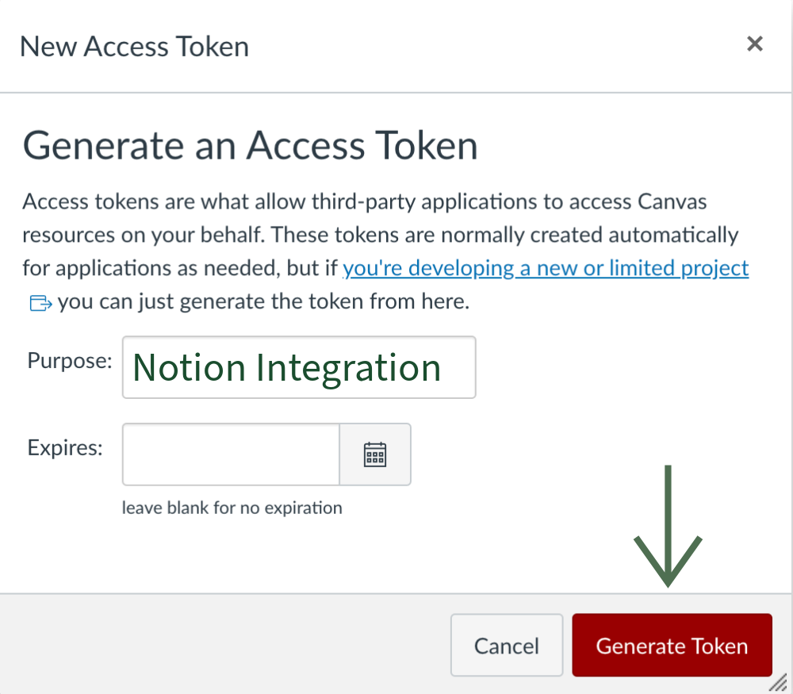
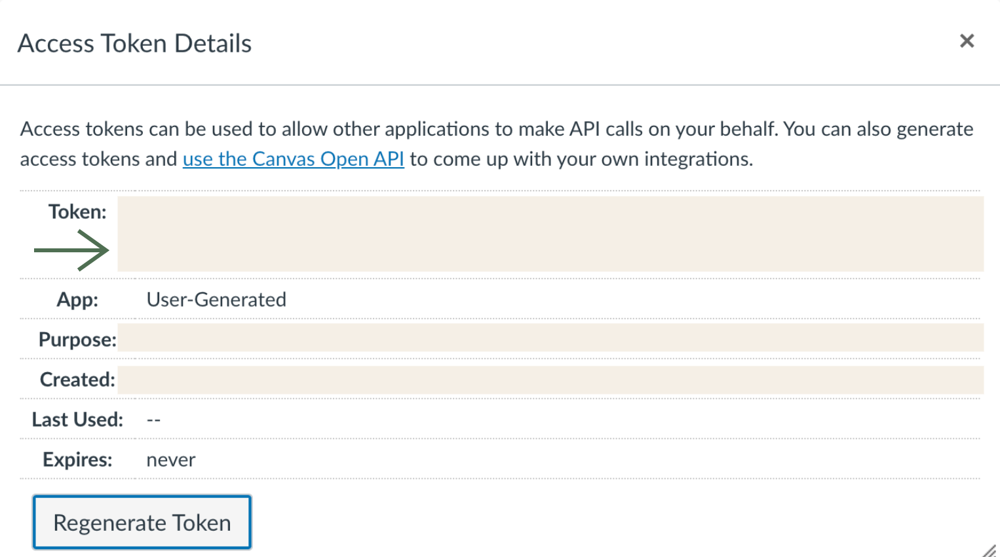

# Canvas to Notion Integration
View your Canvas assignments in Notion created by Mari Garey!


## Introduction

> [!IMPORTANT]
> There will be an overhaul on this repo to make it more manageable!
> I will be looking into adding additional features as well, so if
> you have any ideas, let me know!

Using this repository you will be able to export all of your assignments from Canvas to a Notion Database!
Following the instructions below will help you set up the database!

### Support the Creator!

* Give a ⭐️ to the repository <sub>please and thank you 🤗</sub>
* Submit a PR for feedback or in the Discussion Tab
* Watch the demo on YT and give it a 👍 


## Using the Canvas to Notion Integration

### Video Tutorial

*Coming Soon*

### 1. Project Setup

```zsh
# Clone this repository to your computer
git clone https://github.com/marigarey/canvas-notion-integration.git

# Open this project
cd canvas-notion-integration
```

#### Without Docker
```zsh
# Install dependencies
npm install
```

#### With Docker
```zsh
# Build image
docker -t canvas-notion-integration build .
```

> [!NOTE]
> This step is not required on most architectures. GHCR should have built the latest version on the following architectures:
> - `linux/amd64`
> - `linux/arm/v6`
> - `linux/arm/v7`
> - `linux/arm64`

### 2. Canvas Token Access

Go to your Canvas Profile Settings and scroll down to `Approved Integrations`.

    Click on `+ New Access Token` to create the token.


    Name your Token, and leave the date blank to have no expiration date.


    Once the Token is generated, copy the Token string.

This string will be your **Canvas API Key**

> [!WARNING]
> Once you move away from that screen you will not be able to access the token string!
> Make sure to save the Token string now!

### 3. Notion API Key Access[^1]

Pull up the [Notion - My Integrations](https://www.notion.so/my-integrations) site and click `+ New Integration`

Enter the name of the integration (ie Canvas Notion Integration) and what workspace the Integration will apply to.
In the `Secrets` tab and copy the _Internal Integration Secret_ this will be your **Notion API Key**.


### 4. Create Integration within Notion

Head to whatever Notion Page you want to put the database in and click on `...` in the top right.
Scroll down to `+ Add Connections`. Find and select the integration. Make sure to click confirm.


### 5. Environment Variable `.env` file Setup
Create a `.env` file and replace all the <> with your own information.
*Keep the `NOTION_DATABASE` variable as is because it will be overwritten when you run the code*
> [!NOTE]
> How to Access the Key for the `NOTION_PAGE`:
> 1. On the desired Notion page, click `Share` then `🔗 Copy link`
> 2. Paste the link down, example url: notion.so/{name}/{page}-**0123456789abcdefghijklmnopqrstuv**?{otherstuff}
> 3. Copy the string of 32 letter and number combination to the `.env` file

```
CANVAS_API_URL=<example: https://canvas-page.edu>
CANVAS_API=<your canvas api token>
NOTION_PAGE=<page id of the parent page to create the database>
NOTION_API=<your notion api key> # filled by user
NOTION_DATABASE='invalid' # filled by integration
```

### 6. Run Code

> [!IMPORTANT]
> To update your database you will have to run the script every time there is a change in Canvas
> It is recomended to rerun the code every semester or class/assignment changes

#### Without Docker
```zsh
node main.js
```

#### With Docker
```zsh
docker run --env-file ./.env canvas-notion-integration
```

> [!NOTE]
> If you did not choose to build the image yourself, you can replace `canvas-notion-integration` with `ghcr.io/marigarey/canvas-notion-integration:main`

## Other Information

In the future I do plan to add more to this, possibly blocks outside of the database.
If you have any suggestions on what I should, please let me know! I want to hear your feedback and improve!

> [!NOTE]
> The ID Property is for internal use and you can hide it in your database
> Hiding a Property:
> 1. Go to `...` on the top right of your database
> 2. Click on the `Properties` Tab
> 3. Click the eye on the `ID` Property
> 4. It should get crossed out and disapear from your database!

<sub>Other: Docker addition doesn't run because the .env file is not set up</sub>

[^1]: [Source of Gifs and for more information on Notion Integrations](https://developers.notion.com/docs/create-a-notion-integration)

