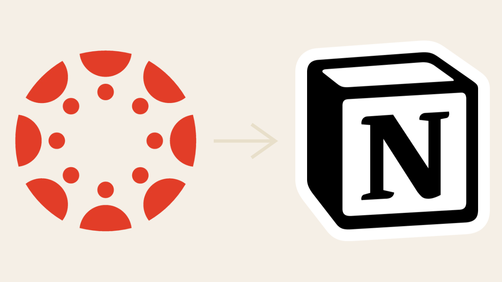
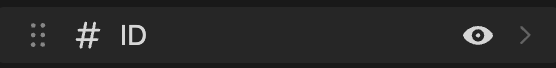
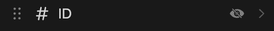

# Canvas to Notion Integration



## Introduction

## Using the Canvas to Notion Integration

### 1. Project Setup

```zsh
# Clone this repository to your computer
gh repo clone marilg/canvas-notion-integration

# Open this project
cd canvas-notion-integration

# Install dependencies
npm install
```

### 2. Canvas Token Access

### 3. Notion API Key Access

### 4. Notion Integration Creation

### 5. Connect Integration Within Notion

### 6. Environment Variable `.env` file Setup

```
CANVAS_API_URL=<example: https://canvas-page.edu> # see 2. for more information
CANVAS_API=<your canvas api token> # see 2. for more information
NOTION_PAGE=<page id of the parent page to create the database> # see 5. for more information
NOTION_API=<your notion api key> # see 4. for more information
NOTION_DATABASE='invalid' # database id will be filled in when you run the script
```

### 7. Run Code

```zhs
node main.js
```

## Other Information

> [!NOTE]
> The ID Property is for internal use and you can hide it in your database
> Hiding a Property:
> 1. Go to `...` on the top right of your database
> 2. Click on the `Properties` Tab
> 3. Click the eye on the `ID` Property
>    → 


